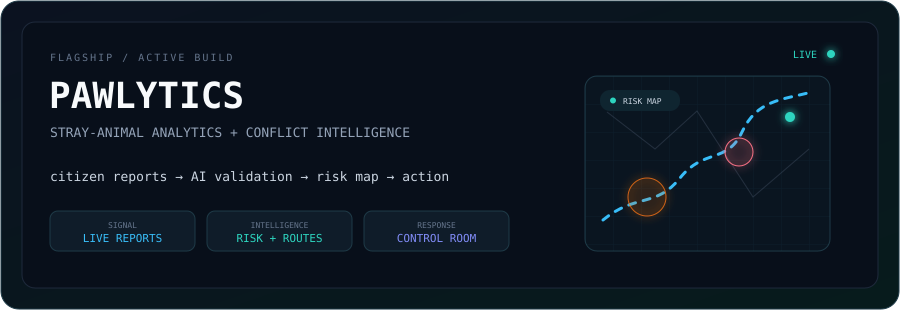

<div align="center">



<br/>

[](https://github.com/UjjvxL)

[](https://github.com/UjjvxL)
[](https://www.linkedin.com/in/ujjval-dubey/)
[](mailto:ujjvalxix19@gmail.com)

</div>

<br/>

## `01 // ABOUT`

I am a **B.Tech Electronics & Communication Engineering** student building at the intersection of **AI, full-stack development, IoT, and data analytics**. I enjoy turning real-world problems into practical, technology-driven products—from intelligent web platforms to connected embedded systems.

My current focus is **[Pawlytics](https://github.com/UjjvxL/Pawlytics)**, an AI-powered stray-animal analytics and conflict-intelligence platform designed for citizens and municipal teams.


## `02 // SYSTEM PROFILE`

<div align="center">



</div>

| Current node | Role |
|---|---|
| 🎓 **IILM University · 2024–2028** | B.Tech — Electronics & Communication Engineering |
| ⚡ **IEEE Electrosapien Club** | President |
| ♟️ **Ranniti Chess Club** | Co-Founder |
| 🐾 **Pawlytics** | Builder / Developer |


## `03 // FLAGSHIP BUILD`

<a href="https://github.com/UjjvxL/Pawlytics">
  
</a>

### Pawlytics — Stray Animal Analytics & Conflict Intelligence

Pawlytics combines citizen reporting, live risk mapping, safe-route analysis, AI-assisted evidence validation, and a municipal authority control room in one platform.

`React` `Vite` `Tailwind CSS` `Supabase` `PostgreSQL` `Leaflet` `Framer Motion` `Vision AI`

- Real-time, ward-level conflict intelligence and verified incident reporting
- Interactive hotspots, route exposure checks, and geospatial risk views
- Municipal triage, escalation rules, field actions, and GIS-ready exports

<p align="center">
  <a href="https://github.com/UjjvxL/Pawlytics"></a>
</p>

### Engine Room — Vitals Monitoring System

A real-time embedded safety system built on the **STM32F411CEU6**. It monitors distance, temperature, and gas levels; drives local OLED, LED, and buzzer alerts; and streams UART telemetry to a live Python dashboard.

`STM32` `Embedded C` `Python` `UART` `I²C` `Sensor Fusion` `Matplotlib`

<p align="center">
  <a href="https://github.com/UjjvxL/Ship-Engine-Room-Safety-Monitor-"></a>
</p>


## `04 // TOOLCHAIN`

<div align="center">

### Core engineering stack

[](https://skillicons.dev)

### AI · embedded · analytics · product tooling


</div>

<details>
<summary><b>View stack by layer</b></summary>
<br/>

| Layer | Technologies |
|---|---|
| **Languages** | Python · JavaScript · C/C++ |
| **Frontend** | React · Vite · HTML · CSS · Tailwind CSS |
| **Backend & data** | Supabase · PostgreSQL · Firebase · REST APIs |
| **AI** | Google Gemini API · AI-assisted development |
| **Embedded** | Arduino · ESP32 · STM32 |
| **Analytics** | Power BI · Tableau · Excel |
| **Build tools** | Git/GitHub · Vercel · Cursor · Claude Code · GitHub Copilot · Codex · KiCad · LTspice |

</details>


## `05 // EXPLORING NEXT`

```text
AI/ML              Computer Vision       AI Agents
RAG                 Agentic LLMs          Automation
Full-Stack          Data Analytics        Geospatial Intelligence
IoT + Embedded      Product Development   Startup Building
```


## `06 // GITHUB TELEMETRY`

<div align="center">


<table>
<tr>
<td width="50%">
  
</td>
<td width="50%">
  
</td>
</tr>
<tr>
<td colspan="2" align="center">
  
</td>
</tr>
</table>

### Contribution snake

<picture>
  <source media="(prefers-color-scheme: dark)" srcset="https://raw.githubusercontent.com/UjjvxL/UjjvxL/output/github-contribution-grid-snake-dark.svg" />
  <source media="(prefers-color-scheme: light)" srcset="https://raw.githubusercontent.com/UjjvxL/UjjvxL/output/github-contribution-grid-snake.svg" />
  
</picture>

</div>


## `07 // COLLABORATE`

I am interested in building ambitious products across **AI, civic technology, full-stack systems, and connected hardware**. If you are working on something useful, experimental, or technically challenging, I would love to hear about it.

<div align="center">

[](https://www.linkedin.com/in/ujjval-dubey/)
[](mailto:ujjvalxix19@gmail.com)

<br/><br/>


<sub>Building useful systems across software, intelligence, and hardware.</sub>

</div>
